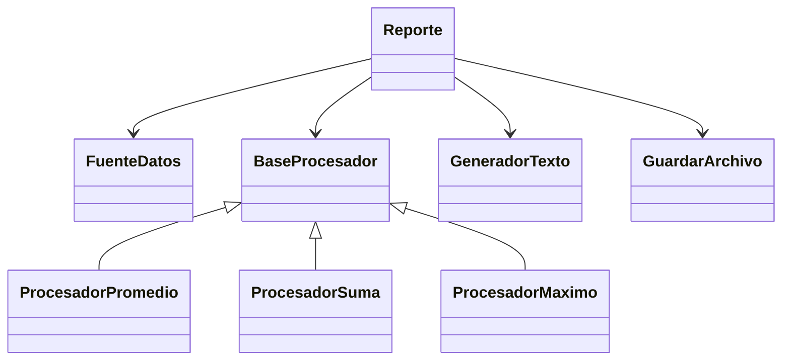

# 📊 Proyecto: Reporte con Principio SRP + Strategy

Este proyecto implementa un **sistema de reportes** aplicando el **Principio de Responsabilidad Única (SRP)** y el **Patrón Strategy** para los procesadores de datos.

---

## 📋 Descripción

<table>
  <tr>
    <th>Módulo</th>
    <th>Responsabilidad</th>
  </tr>
  <tr>
    <td><code>FuenteDatos</code></td>
    <td>Obtener datos desde una fuente (ejemplo: lista fija).</td>
  </tr>
  <tr>
    <td><code>Procesadores</code> (Strategy)</td>
    <td>Definir distintas estrategias de procesamiento (promedio, suma, máximo).</td>
  </tr>
  <tr>
    <td><code>Generadores</code></td>
    <td>Dar formato a la salida (texto o JSON).</td>
  </tr>
  <tr>
    <td><code>Entregadores</code></td>
    <td>Guardar o mostrar el resultado (archivo o consola).</td>
  </tr>
  <tr>
    <td><code>Reporte</code></td>
    <td>Orquestar el flujo completo.</td>
  </tr>
</table>

---

## 🧩 Diagrama de clases (Mermaid)

## 🚀 Ejecución del código

1. Clonar el repositorio:

git clone <URL_DEL_REPO>
cd practica_srp

2. Ejecutar el programa:

python main.py

3. Ejemplos incluidos en main.py:

Promedio + Texto + Archivo → genera reporte.txt

Suma + JSON + Consola

Máximo + Texto + Consola

## 🧪 Testing
Tests unitarios

1. Instalar pytest (si no lo tenés):

pip install pytest

2. Ejecutar los tests desde la carpeta raíz del proyecto:

pytest -v

3. Ejemplo de salida esperada:

collected 5 items

tests/test_procesadores.py::test_procesador_promedio PASSED
tests/test_procesadores.py::test_procesador_suma PASSED
tests/test_procesadores.py::test_procesador_maximo PASSED
tests/test_generadores.py::test_generador_texto PASSED
tests/test_generadores.py::test_generador_json PASSED

## Test de integración del Reporte

Se incluye en tests/test_reporte.py

Verifica que todo el flujo (datos → procesador → generador → entregador) funcione correctamente.

## ⚡ Scripts de ejecución automática
1. Linux/macOS → run.sh

#!/bin/bash
echo "Ejecutando main.py..."
python main.py

echo "Ejecutando tests..."
pytest -v

2. Dar permisos de ejecución:

chmod +x run.sh

3. Windows → run.bat

@echo off
echo Ejecutando main.py...
python main.py

echo Ejecutando tests...
pytest -v
pause

. Permite ejecutar programa + tests con un solo comando.

## 📌 mejoras del proyecto
<table> <thead> <tr> <th>Categoría</th> <th>Qué se hizo</th> <th>Beneficio</th> </tr> </thead> <tbody> <tr> <td><strong>SRP (Single Responsibility Principle)</strong></td> <td>Se separó la clase Reporte en: FuenteDatos, Procesadores, Generadores, Entregadores y Reporte como orquestador.</td> <td>Cada clase tiene <strong>una sola razón para cambiar</strong>; código modular y fácil de mantener.</td> </tr> <tr> <td><strong>Strategy</strong></td> <td>Los procesadores implementan un patrón Strategy mediante una clase base BaseProcesador.</td> <td>Permite <strong>cambiar el algoritmo de procesamiento</strong> sin modificar el resto del sistema.</td> </tr> <tr> <td><strong>Interfaz / Polimorfismo</strong></td> <td>BaseProcesador funciona como interfaz abstracta; Reporte usa cualquier procesador sin modificar su código.</td> <td>Demuestra polimorfismo y flexibilidad de diseño.</td> </tr> <tr> <td><strong>Extensibilidad</strong></td> <td>Se agregaron GeneradorJSON, MostrarConsola, además de las versiones originales.</td> <td>Permite agregar nuevas salidas o entregadores sin tocar el código existente.</td> </tr> <tr> <td><strong>Estructura de carpetas</strong></td> <td>fuentes/, procesadores/, generadores/, entregadores/, reporte/, tests/</td> <td>Código ordenado y modular, fácil de navegar.</td> </tr> <tr> <td><strong>Tests</strong></td> <td>Tests unitarios y de integración del flujo completo del Reporte.</td> <td>Verifica que todas las piezas funcionen correctamente y de manera conjunta.</td> </tr> <tr> <td><strong>Ejemplos en main.py</strong></td> <td>Promedio+Texto+Archivo, Suma+JSON+Consola, Máximo+Texto+Consola.</td> <td>Documentación viva y demostración inmediata de funcionalidad.</td> </tr> <tr> <td><strong>Scripts de ejecución</strong></td> <td>run.sh (Linux/macOS) y run.bat (Windows) para ejecutar programa + tests</td> <td>Ejecutar todo con un solo comando, facilita pruebas y demostraciones.</td> </tr> </tbody> </table>

## 📂 Estructura del proyecto

practica_srp/
├── main.py
├── README.md
├── run.sh
├── run.bat
├── fuentes/
│   └── fuente_datos.py
├── procesadores/
│   ├── base_procesador.py
│   ├── procesador_promedio.py
│   ├── procesador_suma.py
│   └── procesador_maximo.py
├── generadores/
│   ├── generador_texto.py
│   └── generador_json.py
├── entregadores/
│   ├── guardar_archivo.py
│   └── mostrar_consola.py
├── reporte/
│   └── reporte.py
└── tests/
    ├── test_procesadores.py
    ├── test_generadores.py
    └── test_reporte.py
